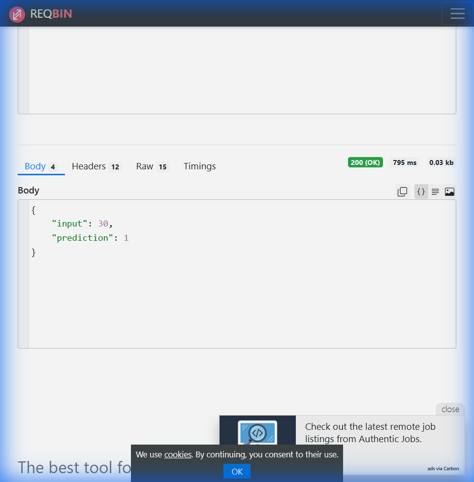
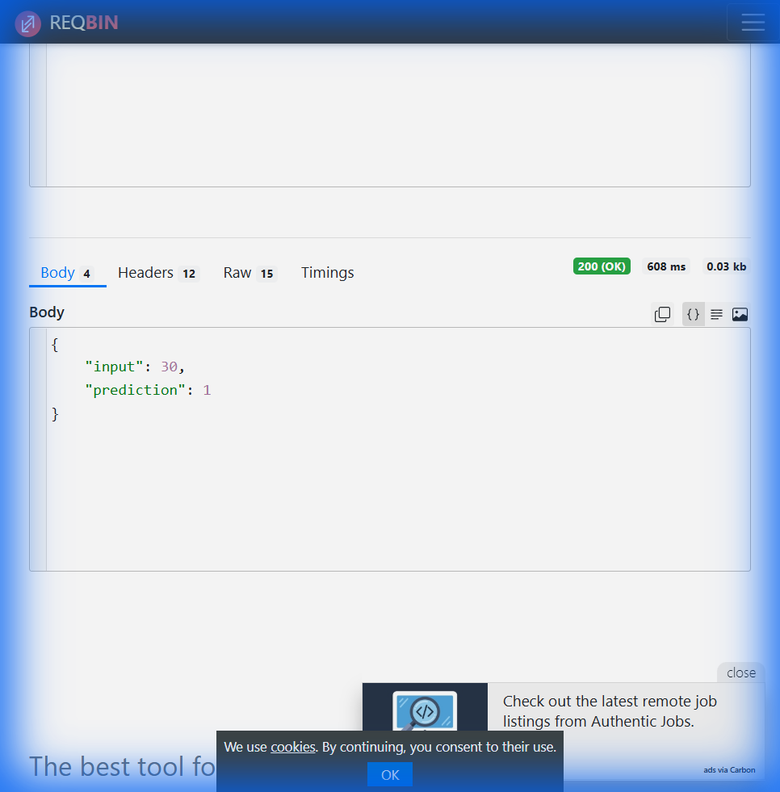

# 🚀 Serverless ML Inference API on AWS Lambda

[](https://aws.amazon.com/lambda/)
[](https://python.org)
[](https://scikit-learn.org)

A fully **serverless, scalable, and cost-efficient** machine learning inference API built with AWS Lambda, API Gateway, and scikit-learn.

---

## 🌐 Live API Endpoint

```
POST https://qxqnt0q8rf.execute-api.ap-south-1.amazonaws.com/Prod/predict
```

---

## 📖 Table of Contents

- [Overview](#-overview)
- [Architecture](#️-architecture)
- [Project Structure](#-project-structure)
- [Prerequisites](#-prerequisites)
- [Installation](#-installation)
- [Training the Model](#-training-the-model)
- [Building & Deploying](#-building--deploying)
- [Testing the API](#-testing-the-api)
- [API Reference](#-api-reference)
- [Model Details](#-model-details)
- [Monitoring & Logs](#-monitoring--logs)
- [Cleanup](#️-cleanup)
- [Troubleshooting](#-troubleshooting)
- [License](#-license)

---

## 🎯 Overview

This project demonstrates how to deploy a machine learning model as a serverless REST API:

- ✅ **Serverless Architecture** - No servers to manage
- ✅ **Auto-scaling** - Handles any load automatically
- ✅ **Cost-efficient** - Pay only for what you use
- ✅ **Low latency** - Fast inference with AWS Lambda
- ✅ **Easy deployment** - Using AWS SAM (Serverless Application Model)

---

## 🏗️ Architecture

```
┌─────────────────┐     ┌─────────────────┐     ┌─────────────────┐
│                 │     │                 │     │                 │
│     Client      │────▶│   API Gateway   │────▶│  AWS Lambda     │
│  (curl/browser) │     │  POST /predict  │     │  (Python 3.12)  │
│                 │     │                 │     │                 │
└─────────────────┘     └─────────────────┘     └────────┬────────┘
                                                         │
                                                         ▼
                                                ┌─────────────────┐
                                                │                 │
                                                │ scikit-learn    │
                                                │   Model (.pkl)  │
                                                │                 │
                                                └────────┬────────┘
                                                         │
                                                         ▼
                                                ┌─────────────────┐
                                                │  JSON Response  │
                                                │ {"prediction":1}│
                                                └─────────────────┘
```

### Flow

1. **Client** sends a POST request with JSON payload `{"value": 30}`
2. **API Gateway** receives the request and routes it to Lambda
3. **Lambda** loads the ML model and makes a prediction
4. **Response** is returned as JSON `{"input": 30, "prediction": 1}`

---

## 📁 Project Structure

```
serverless-ml-api/
│
├── model/
│   └── model.pkl              # Pre-trained scikit-learn model
│
├── app.py                     # Lambda handler (inference logic)
├── train_model.py             # Script to train the ML model
├── requirements.txt           # Python dependencies
├── template.yaml              # AWS SAM configuration
├── event.json                 # Sample test event for local testing
├── samconfig.toml             # SAM deployment configuration (auto-generated)
└── README.md                  # This file
```

---

## 📋 Prerequisites

Before you begin, ensure you have the following installed:

### 1. Python 3.12+
```bash
python --version
# Python 3.12.x
```

### 2. AWS CLI v2
Download from: https://docs.aws.amazon.com/cli/latest/userguide/getting-started-install.html

```bash
aws --version
# aws-cli/2.x.x
```

### 3. AWS SAM CLI
Download from: https://docs.aws.amazon.com/serverless-application-model/latest/developerguide/install-sam-cli.html

```bash
sam --version
# SAM CLI, version 1.x.x
```

### 4. AWS Account & Credentials
You need an AWS account with appropriate permissions:
- Lambda
- API Gateway
- CloudFormation
- S3
- IAM

---

## 🔧 Installation

### Step 1: Clone or Create the Project

```bash
# Create project directory
mkdir serverless-ml-api
cd serverless-ml-api
```

### Step 2: Install Python Dependencies

```bash
pip install scikit-learn joblib
```

### Step 3: Configure AWS Credentials

```bash
aws configure
```

Enter your:
- **AWS Access Key ID**: Your access key
- **AWS Secret Access Key**: Your secret key
- **Default region**: `ap-south-1` (or your preferred region)
- **Default output format**: `json`

Verify configuration:
```bash
aws sts get-caller-identity
```

---

## 🧠 Training the Model

### Run the Training Script

```bash
python train_model.py
```

**Output:**
```
Model trained and saved to model/model.pkl
```

### What the Model Does

The model is a simple **Logistic Regression** classifier:
- **Input**: A single numeric value (e.g., age)
- **Output**: Binary classification (0 or 1)
- **Decision Boundary**: ~27.5
  - Values **< 27.5** → Prediction: **0**
  - Values **≥ 27.5** → Prediction: **1**

### Training Data

```python
X = [[20], [25], [30], [35]]
y = [0, 0, 1, 1]
```

---

## 🚀 Building & Deploying

### Step 1: Build the Project

```bash
sam build
```

**Expected Output:**
```
Building codeuri: . runtime: python3.12
Running PythonPipBuilder:ResolveDependencies
Running PythonPipBuilder:CopySource
Build Succeeded
```

### Step 2: Deploy to AWS

#### Option A: Guided Deployment (First Time)

```bash
sam deploy --guided
```

Follow the prompts:
- **Stack name**: `ml-inference-api`
- **AWS Region**: `ap-south-1`
- **Confirm changes before deploy**: `y`
- **Allow SAM CLI IAM role creation**: `y`
- **Save arguments to samconfig.toml**: `y`

#### Option B: Quick Deployment (After First Time)

```bash
sam deploy
```

### Step 3: Note the API Endpoint

After deployment, you'll see:
```
Outputs
-------------------------------------------
Key                 PredictApi
Value               https://xxxxxx.execute-api.ap-south-1.amazonaws.com/Prod/predict
```

**Save this URL** - it's your API endpoint!

---

## 🧪 Testing the API

### Using PowerShell (Windows)

```powershell
# Test with value 30 (should return prediction: 1)
Invoke-RestMethod -Uri "https://qxqnt0q8rf.execute-api.ap-south-1.amazonaws.com/Prod/predict" -Method POST -ContentType "application/json" -Body '{"value": 30}'

# Test with value 20 (should return prediction: 0)
Invoke-RestMethod -Uri "https://qxqnt0q8rf.execute-api.ap-south-1.amazonaws.com/Prod/predict" -Method POST -ContentType "application/json" -Body '{"value": 20}'
```

### Using curl (Linux/Mac/Git Bash)

```bash
# Test with value 30
curl -X POST \
  https://qxqnt0q8rf.execute-api.ap-south-1.amazonaws.com/Prod/predict \
  -H "Content-Type: application/json" \
  -d '{"value": 30}'

# Test with value 20
curl -X POST \
  https://qxqnt0q8rf.execute-api.ap-south-1.amazonaws.com/Prod/predict \
  -H "Content-Type: application/json" \
  -d '{"value": 20}'
```

### Using Online Tools

1. Go to [ReqBin](https://reqbin.com/post-online)
2. Enter URL: `https://qxqnt0q8rf.execute-api.ap-south-1.amazonaws.com/Prod/predict`
3. Method: **POST**
4. Add header: `Content-Type: application/json`
5. Body: `{"value": 30}`
6. Click **Send**

### Expected Responses

| Input | Response |
|-------|----------|
| `{"value": 20}` | `{"input": 20, "prediction": 0}` |
| `{"value": 25}` | `{"input": 25, "prediction": 0}` |
| `{"value": 30}` | `{"input": 30, "prediction": 1}` |
| `{"value": 35}` | `{"input": 35, "prediction": 1}` |

### 📸 Screenshots

#### PowerShell API Test


#### API Test Result


---

## 📚 API Reference

### POST /predict

Make a prediction based on input value.

**URL:**
```
POST https://qxqnt0q8rf.execute-api.ap-south-1.amazonaws.com/Prod/predict
```

**Headers:**
```
Content-Type: application/json
```

**Request Body:**
```json
{
  "value": 30
}
```

**Success Response (200 OK):**
```json
{
  "input": 30,
  "prediction": 1
}
```

**Error Response (400 Bad Request):**
```json
{
  "error": "Missing required field: 'value'"
}
```

**Error Response (500 Internal Server Error):**
```json
{
  "error": "Error message here"
}
```

---

## 🔬 Model Details

### Algorithm
- **Type**: Logistic Regression (Binary Classification)
- **Library**: scikit-learn
- **File**: `model/model.pkl` (serialized with joblib)

### Performance Characteristics
- **Cold Start**: ~2-3 seconds (first invocation)
- **Warm Start**: ~100-200ms (subsequent invocations)
- **Model Size**: ~831 bytes

### Customizing the Model

To use your own model:

1. Train your model in `train_model.py`
2. Ensure it has a `.predict()` method
3. Save it to `model/model.pkl`
4. Rebuild and redeploy:
   ```bash
   sam build && sam deploy
   ```

---

## 📊 Monitoring & Logs

### View Real-time Logs

```bash
sam logs -n MLInferenceFunction --tail
```

### View in AWS Console

1. Go to [CloudWatch Logs](https://ap-south-1.console.aws.amazon.com/cloudwatch/home?region=ap-south-1#logsV2:log-groups)
2. Find log group: `/aws/lambda/ml-inference-api-MLInferenceFunction-*`
3. Click to view log streams

### Metrics to Monitor
- **Invocations**: Number of API calls
- **Duration**: Execution time
- **Errors**: Failed invocations
- **Throttles**: Rate-limited requests

---

## 🗑️ Cleanup

To delete all AWS resources and avoid charges:

```bash
sam delete --stack-name ml-inference-api --region ap-south-1
```

This removes:
- Lambda function
- API Gateway
- IAM roles
- CloudFormation stack
- S3 deployment artifacts

---

## 🔧 Troubleshooting

### "Python 3.12 not found" during `sam build`

**Solution**: Use the `--use-container` flag (requires Docker):
```bash
sam build --use-container
```

Or update `template.yaml` to match your Python version.

### "Access Denied" during deployment

**Solution**: Ensure your AWS user has these permissions:
- `AWSLambda_FullAccess`
- `AmazonAPIGatewayAdministrator`
- `AWSCloudFormationFullAccess`
- `AmazonS3FullAccess`
- `IAMFullAccess` (for role creation)

### "Unable to locate credentials"

**Solution**: Configure AWS credentials:
```bash
aws configure
```

### Cold Start Latency

**Tip**: Keep the Lambda warm by:
- Using provisioned concurrency
- Setting up CloudWatch Events to ping the function periodically

---

## 🛠️ Local Development

### Test Lambda Locally (requires Docker)

```bash
# Invoke function with test event
sam local invoke MLInferenceFunction -e event.json

# Start local API server
sam local start-api

# Then test with:
curl http://127.0.0.1:3000/predict -X POST -H "Content-Type: application/json" -d '{"value": 30}'
```

---

## 📜 Files Explained

| File | Description |
|------|-------------|
| `app.py` | Lambda handler - receives requests, loads model, returns predictions |
| `train_model.py` | Training script - creates and saves the ML model |
| `requirements.txt` | Python dependencies (scikit-learn, joblib) |
| `template.yaml` | AWS SAM template - defines Lambda, API Gateway, permissions |
| `event.json` | Sample event for local testing |
| `model/model.pkl` | Serialized trained model |

---

## 📈 Extending the Project

### Ideas for Enhancement

1. **Add more features**: Accept multiple input values
2. **Different models**: Use neural networks, XGBoost, etc.
3. **Authentication**: Add API keys or JWT tokens
4. **Caching**: Use ElastiCache for frequently requested predictions
5. **Batch predictions**: Accept arrays of values
6. **Model versioning**: Support multiple model versions

---

## 👨‍💻 Author

Built as a serverless ML deployment demonstration.

---

## 📄 License

MIT License - feel free to use and modify!

---

## 🙏 Acknowledgments

- [AWS SAM](https://aws.amazon.com/serverless/sam/) - Serverless Application Model
- [scikit-learn](https://scikit-learn.org/) - Machine Learning Library
- [AWS Lambda](https://aws.amazon.com/lambda/) - Serverless Compute
